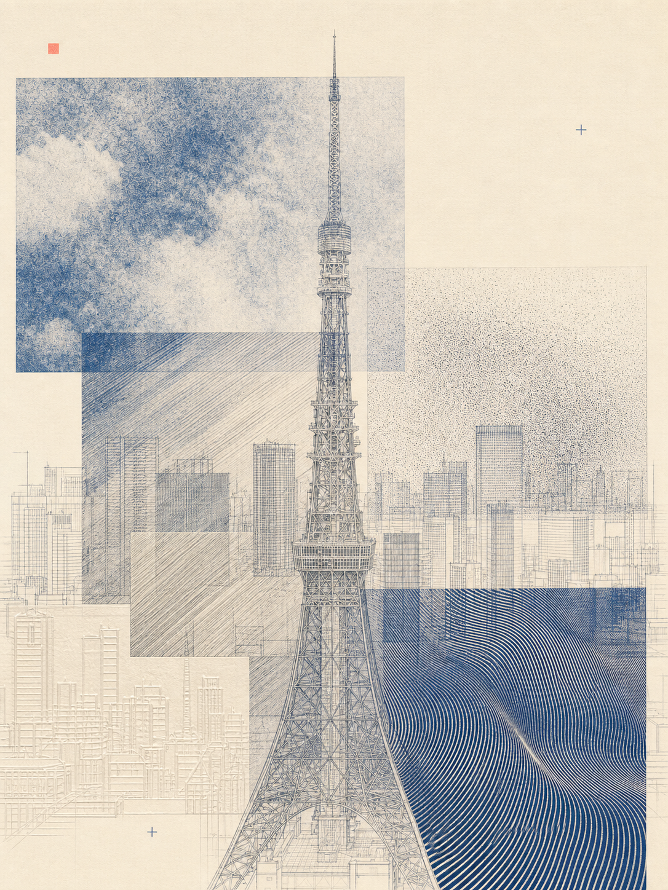
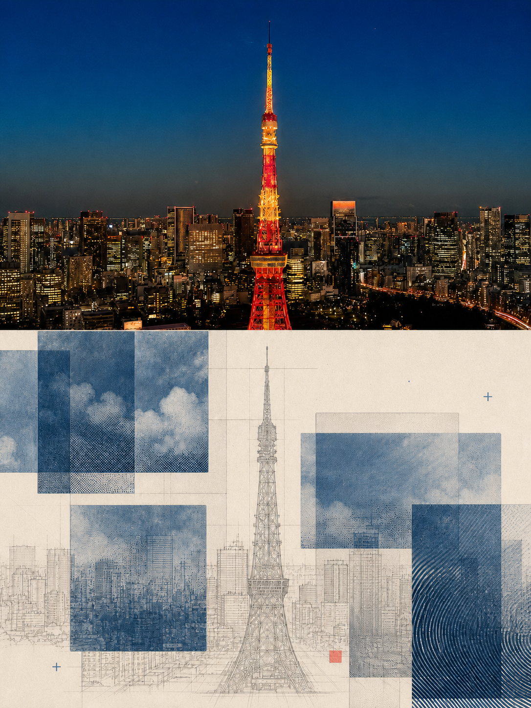

# Optical Zine Poster

<p align="center">
  <strong>简体中文</strong> · <a href="README_EN.md">English</a>
</p>

<p align="center">
  <strong>把一张原图，变成光学实验版画海报。</strong><br>
  语义选风格 · 单次生成完整设计 · 11 套视觉程序 · 可选上下 1:1 对照版
</p>

<p align="center">
  <a href="https://github.com/WiseWong6/optical-zine-poster/blob/main/LICENSE"></a>
  <a href="https://github.com/WiseWong6/wise-skills"></a>
</p>

<p align="center">
  <a href="#快速开始">快速开始</a> ·
  <a href="#11-套风格程序">风格目录</a> ·
  <a href="#输出与验收">输出合同</a> ·
  <a href="references/style-catalog.html">本地风格图册</a>
</p>

Optical Zine Poster 是一个为 Codex 封装的图像生成 Skill。它读取源图中的主体结构、透视、材质、氛围、动静关系与留白需求，从 11 套视觉程序中选择最合适的一套，并直接生成一张完整的 3:4 视觉海报。

默认不是“上图下设计”的对照稿，也不是先做母版再叠效果。第一次调用会把原图作为唯一图像输入，一次生成完整全图；完成后再询问你是否需要同风格的上下 1:1 对照版，或浏览并尝试其他风格。

## 效果预览

<table>
  <tr>
    <th width="50%">默认 Full Design · S08</th>
    <th width="50%">可选 Split 1:1 · S08</th>
  </tr>
  <tr>
    <td></td>
    <td></td>
  </tr>
  <tr>
    <td>整张画面完成视觉转译，不保留摄影窗口。</td>
    <td>同一张 3:4 海报，上半原图、下半设计，各占 50%。</td>
  </tr>
</table>

> 示例仅用于说明成品结构。每次生成始终回到用户提供的原始源图，不会把示例或上一张生成结果继续作为输入。

## 核心能力

- **语义选风格**：未指定风格时，自动分析源图，选取一个最匹配的 `S01–S11` 视觉程序。
- **完整全图优先**：默认生成 Full Design，整张画面都进入统一的印刷与光学语言。
- **单次生成**：由“模式骨架 + 一个风格模块 + 比例与禁止项 + 自检规则”组成一次完整调用。
- **可选对照模式**：用户明确选择后，从原始源图重新生成上半摄影、下半设计的 Split 1:1 版本。
- **严格输入隔离**：参考图只用于浏览，永远不会进入图片生成上下文。
- **可验证输出**：脚本检查精确 3:4、命名、风格资产与图册引用；失败时不靠拉伸或裁切伪装修复。
- **不覆盖历史文件**：同名输出自动递增 `v1`、`v2`……保留每次尝试。

## 视觉方向

这套 Skill 面向的不是 UI 卡片、普通滤镜或模板化拼贴，而是把照片重新组织为带有材料感、印刷误差与光学实验气质的独立海报：

- 暖象牙纸、石墨灰、蓝晒蓝、油墨黑与克制的局部色彩；
- 网点、摩尔纹、套印偏移、接触印相、透明描图层与结构切片；
- 识别度优先：主体和空间关系必须保留，效果服务于原图语义；
- Full Design 不保留摄影窗口；Split 只允许一条中线，且上下各占 50%；
- 拒绝无意义文字、Logo、水印、规则 UI 网格、设备 Mockup 和无关拼贴碎片。

## 11 套风格程序

| ID | 风格 | 最适合的源图语义 | 强度 |
| --- | --- | --- | --- |
| `S01` | Blue Exposure Laboratory | 建筑、街景、层叠立面、蓝晒曝光层次 | 中 |
| `S02` | Optical Field Array | 强透视、重复线条、道路、缆线、结构节奏 | 中高 |
| `S03` | EdgeLoom Effect Sampler | 异质细节、实验编辑感、多种局部纹理 | 高 |
| `S04` | Quiet Effect Cabinet | 安静单体、精细材质、大量留白 | 低 |
| `S05` | Ink Grid Interference | 人工几何、网格、立面、技术制图 | 中 |
| `S06` | Cyanotype Optical Plates | 分层建筑、不对称蓝晒版、透明叠印 | 中 |
| `S07` | Registration Weather | 雾、雨、云、天空、变化光线 | 低中 |
| `S08` | Material Tectonics | 多材料、结构层次、复杂表面；通用默认 | 中高 |
| `S09` | Monochrome Data Garden | 植物、风、粒子、有机生长、柔性运动 | 中 |
| `S10` | Selected Synthesis | 有机曲线与建筑直线并置 | 中高 |
| `S11` | Cyanotype Ma Registry | 居中或对称单体、安静边缘、空间留白 | 低 |

需要看图选择时，下载仓库后直接打开 [`references/style-catalog.html`](references/style-catalog.html)。图册中的卡片包含编号、名称、适用语义、视觉强度和参考图；分屏参考图默认聚焦下半设计区，也能打开完整原图。

## 语义选择逻辑

未指定 `Sxx` 时，Skill 只选择一个风格，不混搭：

1. 明确的用户选择始终优先；
2. 强透视或线性节奏优先 `S02`；
3. 多材料或复杂结构优先 `S08`；
4. 安静单体与大量留白优先 `S04` / `S11`；
5. 雾、雨、天空等氛围优先 `S07`；
6. 有机与建筑混合优先 `S10`；
7. 没有更强语义时，以 `S08` 作为稳健默认。

最终交付会说明所选风格，并给出一条与当前源图直接相关的选择理由。

## 运行要求

- Codex 桌面端或具备宿主内置 `image_gen.imagegen` 的 Codex 环境；
- 至少一张可访问的源图；
- Python 3，仅用于本地资产与输出比例校验；
- 无需配置第三方图片 API Key。

### 图片生成边界

本 Skill **只允许使用 Codex 宿主内置的图片生成能力**。如果内置工具不可用或调用失败，工作流会停止并说明阻塞原因，不会自动回退到 Ark、Doubao、Gemini、本地模型、CLI 或其他图片服务。

## 安装

### 方式一：直接安装到 Codex Skills

```bash
git clone https://github.com/WiseWong6/optical-zine-poster.git \
  ~/.codex/skills/optical-zine-poster
```

更新：

```bash
git -C ~/.codex/skills/optical-zine-poster pull --ff-only
```

### 方式二：保留开发目录并使用软链

```bash
git clone https://github.com/WiseWong6/optical-zine-poster.git \
  /path/to/optical-zine-poster
ln -s /path/to/optical-zine-poster \
  ~/.codex/skills/optical-zine-poster
```

当前 Skill 也收录在 [Wise Skills](https://github.com/WiseWong6/wise-skills) 合集，适合统一浏览我的其他 Codex Skills。

## 快速开始

在 Codex 中附上一张源图，然后调用：

```text
$optical-zine-poster
把这张图做成光学杂志海报。
```

### 指定风格

```text
$optical-zine-poster
使用 S02，把这张道路照片生成完整 3:4 全图。
```

### 请求上下 1:1 对照版

```text
$optical-zine-poster
沿用刚才的风格，用原始源图生成上下 1:1 对照版。
```

### 浏览其他风格

```text
$optical-zine-poster
我想看看其他风格，请给我风格图册和选择建议。
```

### 指定输出位置

```text
$optical-zine-poster
用 S11 生成完整全图，输出到 /absolute/path/to/posters/。
```

## 请求模式

### Full Design（默认）

- 输出一张完整 3:4 海报；
- 全画面完成视觉转译；
- 不保留矩形摄影窗口或上下分屏；
- 主体仍需可识别，环境关系保持连贯。

### Split 1:1（可选）

- 仍是一张 3:4 海报；
- 上半为忠实原图，下半为同风格设计转译；
- 只允许一条位于中点的水平边界；
- 必须从原始源图重新生成，不能使用 Full 成品做二次输入。

### Alternate Style（可选）

- 用户选择另一个 `Sxx` 后，默认仍生成 Full Design；
- 只有明确要求时，才生成该风格的 Split 版本；
- 每一种风格探索都回到原始源图。

## 输出与验收

默认写入调用任务工作区：

```text
outputs/optical-zine-poster/
├── <source>-full-Sxx-v1.png
├── <source>-full-Sxx-v1.prompt.md
├── <source>-split-Sxx-v1.png          # 可选
└── <source>-split-Sxx-v1.prompt.md   # 可选
```

验收规则：

- 像素尺寸必须精确满足 `width:height = 3:4`；
- Full 必须是完整设计，不得出现摄影窗口或分屏；
- Split 必须只有一条中线，上下视觉高度各 50%；
- 主体可识别，环境连贯；
- 不接受 Logo、水印、UI 网格、Mockup、无关拼贴和乱码；
- 比例失败时，从原始源图以同一风格定向重试一次；再次失败则保留证据并明确报告未通过。

## 已知边界

- 生成模型可能无法稳定绘制精确可读的小字，因此视觉系统不依赖长段文字成立；
- `validate_output.py` 能精确检查比例与基础图像条件，但 Split 中线位置仍需要轻量人工确认；
- 风格参考图是选择文档，不是模型输入；将其作为第二张输入会破坏 Skill 的可追溯边界；
- `R-S08-B` 是 2:3 的次级审美参考，只能出现在明确标记的非交付区域，不是合格输出样本。

## Star 与反馈

<p align="center">
  <a href="https://star-history.com/#WiseWong6/optical-zine-poster&Date">
    
  </a>
</p>

图表由 Star History 自动更新；点击后打开外部统计页。如果这个 Skill 帮你做出了有意思的海报，欢迎在 GitHub 页面右上角点亮 Star。

你也可以通过 Issue 分享：

- 你的源图与最终成品；
- 自动选风格是否符合预期；
- 希望增加的风格语义或输出模式；
- 可复现的比例、构图或提示词问题。

## 关于作者

全网同名 **@歪斯Wise**，持续分享 AI 创作、Agent 工作流、视觉设计与效率工具。

<p>
  <a href="https://x.com/killthewhys">X / Twitter</a> ·
  <a href="https://www.xiaohongshu.com/user/profile/61f3ea4f000000001000db73">小红书</a> ·
  <a href="https://github.com/WiseWong6/wise-skills">Wise Skills</a>
</p>

<p><strong>微信公众号</strong></p>
<p></p>

## License

[MIT](LICENSE) © 2026 Wise Wong
