# Optical Zine Poster

<p align="center">
  <a href="README.md">简体中文</a> · <strong>English</strong>
</p>

<p align="center">
  <a href="https://github.com/WiseWong6/optical-zine-poster/blob/main/LICENSE"></a>
  <a href="https://github.com/WiseWong6/wise-skills"></a>
</p>

<p align="center">
  <a href="#quick-start">Quick Start</a> ·
  <a href="#11-style-programs">Style Catalog</a> ·
  <a href="#output-and-acceptance">Output Contract</a> ·
  <a href="references/style-catalog.html">Local Style Catalog</a>
</p>

Optical Zine Poster is an image-generation Skill built for Codex. It can turn one source image into an optical experimental print poster.

It reads the source image's subject structure, perspective, materials, atmosphere, motion, and negative-space needs, selects the most suitable style from 11 visual programs, and generates a complete 3:4 poster.

## Preview

<table>
  <tr>
    <th width="50%">Default Full Design · S08</th>
    <th width="50%">Optional Split 1:1 · S08</th>
  </tr>
  <tr>
    <td>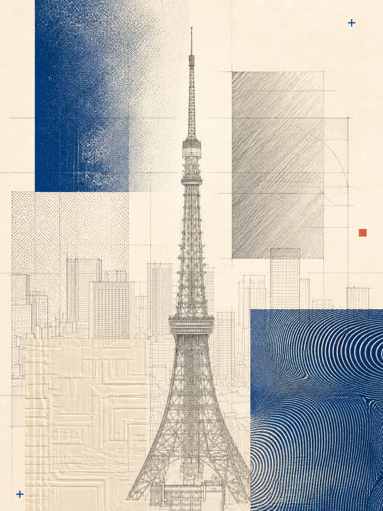</td>
    <td>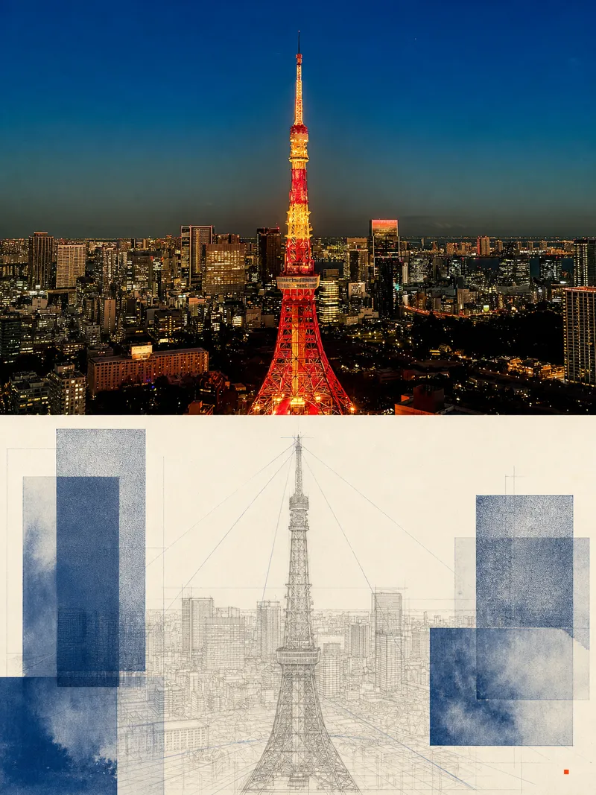</td>
  </tr>
  <tr>
    <td>The entire image is translated into one visual system, with no photographic window retained.</td>
    <td>One 3:4 poster with the original image above and the designed translation below, each occupying 50%.</td>
  </tr>
</table>

> The examples demonstrate output structure only. Every generation starts from the user's original source image. Examples and previous outputs are never reused as image inputs.

## Core Capabilities

- **Semantic style selection**: when no style is specified, the Skill analyzes the source and chooses one best-fitting program from `S01–S11`.
- **Full design by default**: the entire canvas is translated into one coherent optical and print language.
- **One-pass generation**: each call combines a mode skeleton, exactly one style module, ratio and exclusion rules, and self-check instructions.
- **Optional comparison mode**: when explicitly requested, the Skill returns to the original source and generates an upper-photo/lower-design Split 1:1 version.
- **Strict input isolation**: reference images are browse-only and never enter the image-generation context.
- **Verifiable output**: scripts check the exact 3:4 ratio, naming, style assets, and catalog links. Failed ratios are never disguised by stretching or cropping.
- **No overwrites**: existing names automatically advance from `v1` to `v2` and beyond.

## Visual Direction

This Skill does not produce UI cards, generic filters, or template collages. It reorganizes photography into an independent poster with material texture, print imperfections, and an optical-experiment sensibility:

- warm ivory paper, graphite gray, cyanotype blue, ink black, and restrained local color;
- halftone, moiré, registration drift, contact printing, translucent tracing layers, and structural slices;
- recognizability first: the subject and spatial relationships remain intact, while effects serve the source semantics;
- Full Design retains no photographic window; Split permits exactly one midpoint boundary with equal upper and lower regions;
- no meaningless text, logos, watermarks, regular UI grids, device mockups, or unrelated collage fragments.

## 11 Style Programs

This page uses newly generated Full Design results from the same Tokyo Tower source image, making the visual differences between all 11 programs easy to compare. Every current full reference follows the same carrier contract: 3–6 visible optical carriers, no more than two clusters, a continuous subject corridor, and at least 40% quiet paper. Click any image to open the full-resolution result.

<table>
  <tr>
    <td width="33.33%" valign="top"><a href="assets/style-references/tokyo-tower-full/R-S01-A-blue-exposure-laboratory-full.png">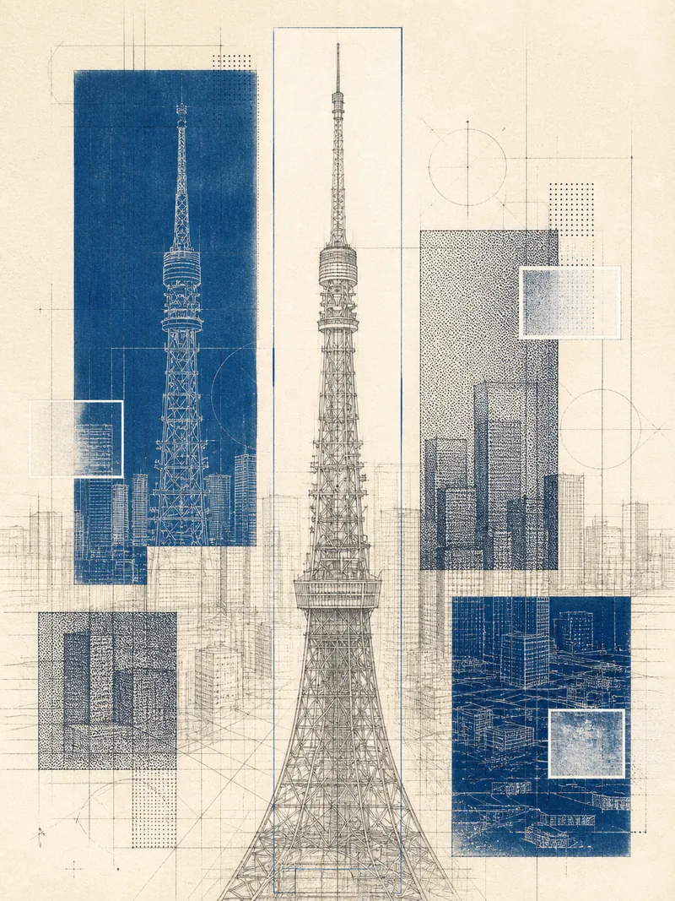</a><br><strong>S01 · Blue Exposure Laboratory</strong><br><sub>Architecture, streets, stacked facades, cyanotype exposure depth · Medium</sub></td>
    <td width="33.33%" valign="top"><a href="assets/style-references/tokyo-tower-full/R-S02-A-optical-field-array-full.png">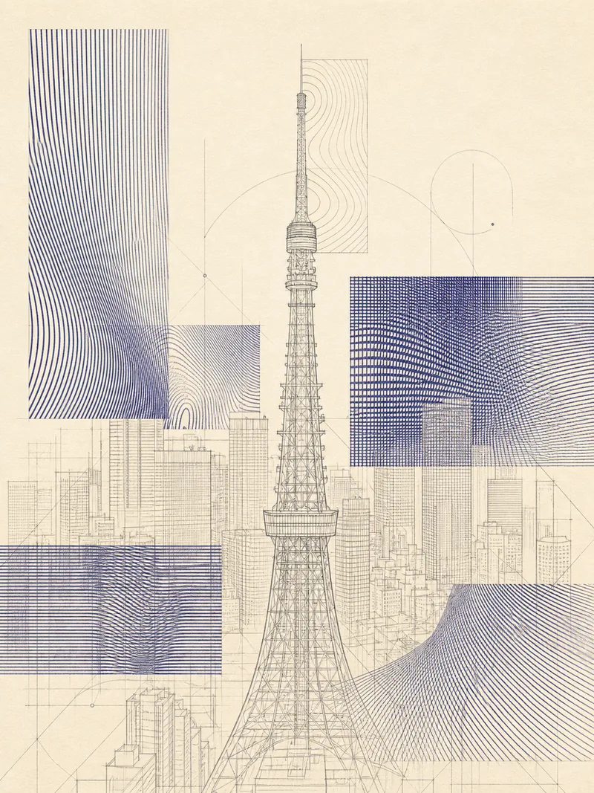</a><br><strong>S02 · Optical Field Array</strong><br><sub>Strong perspective, repeated lines, roads, cables, structural rhythm · Medium–high</sub></td>
    <td width="33.33%" valign="top"><a href="assets/style-references/tokyo-tower-full/R-S03-A-edgeloom-effect-sampler-full.png">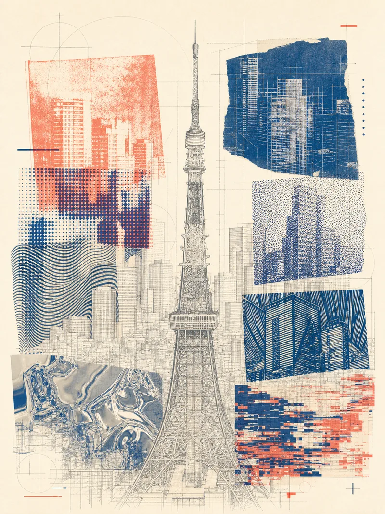</a><br><strong>S03 · EdgeLoom Effect Sampler</strong><br><sub>Heterogeneous detail, experimental editorial energy, varied local textures · High</sub></td>
  </tr>
  <tr>
    <td width="33.33%" valign="top"><a href="assets/style-references/tokyo-tower-full/R-S04-A-quiet-effect-cabinet-full.png">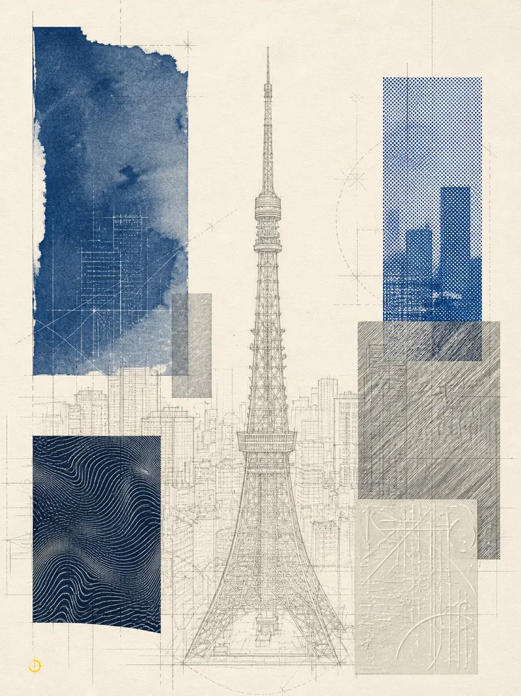</a><br><strong>S04 · Quiet Effect Cabinet</strong><br><sub>Quiet isolated subjects, refined materials, abundant negative space · Low</sub></td>
    <td width="33.33%" valign="top"><a href="assets/style-references/tokyo-tower-full/R-S05-A-ink-grid-interference-full.png">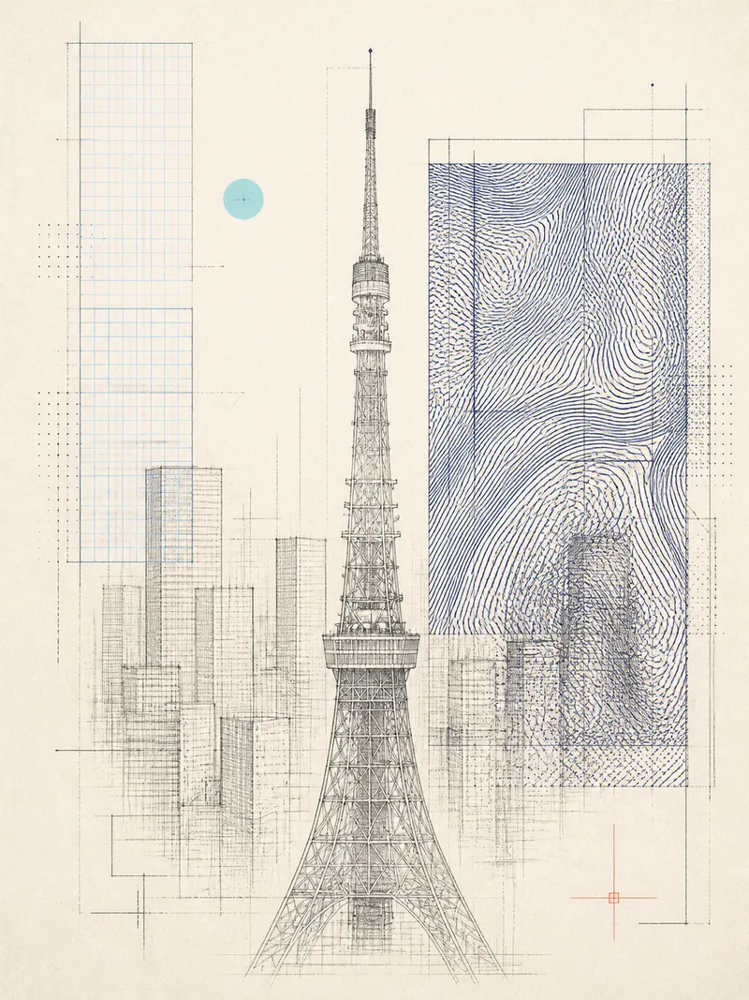</a><br><strong>S05 · Ink Grid Interference</strong><br><sub>Man-made geometry, grids, facades, technical drawing · Medium</sub></td>
    <td width="33.33%" valign="top"><a href="assets/style-references/tokyo-tower-full/R-S06-A-cyanotype-optical-plates-full.png">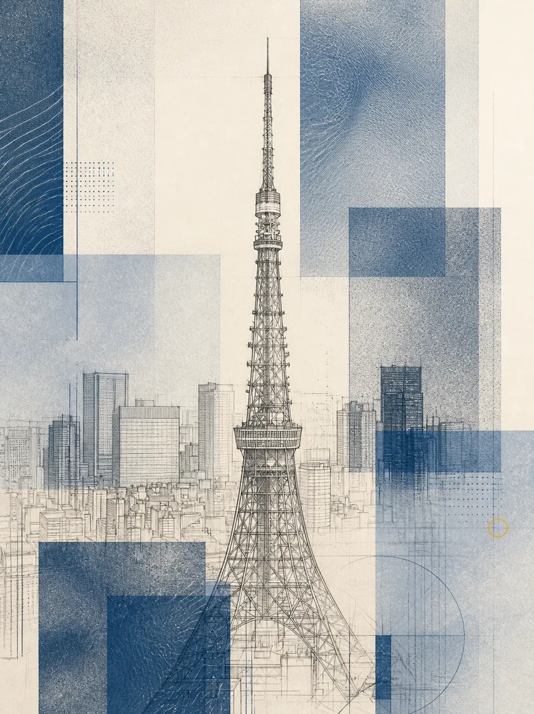</a><br><strong>S06 · Cyanotype Optical Plates</strong><br><sub>Layered architecture, asymmetric cyanotype plates, translucent overprinting · Medium</sub></td>
  </tr>
  <tr>
    <td width="33.33%" valign="top"><a href="assets/style-references/tokyo-tower-full/R-S07-A-registration-weather-full.png">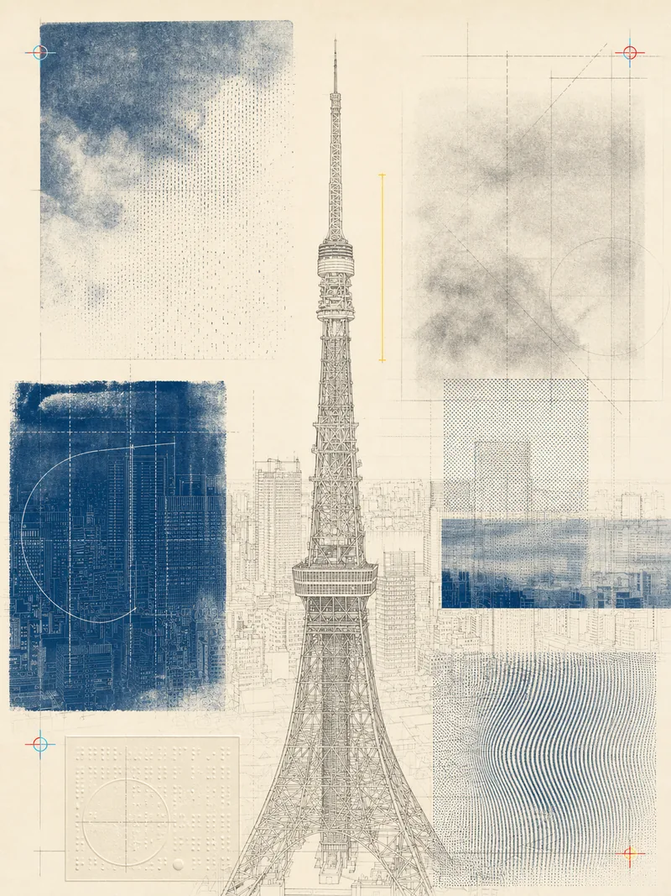</a><br><strong>S07 · Registration Weather</strong><br><sub>Fog, rain, clouds, sky, changing light · Low–medium</sub></td>
    <td width="33.33%" valign="top"><a href="assets/style-references/tokyo-tower-full/R-S08-A-material-tectonics-full.png"></a><br><strong>S08 · Material Tectonics</strong><br><sub>Multiple materials, structural layers, complex surfaces; general default · Medium–high</sub></td>
    <td width="33.33%" valign="top"><a href="assets/style-references/tokyo-tower-full/R-S09-A-monochrome-data-garden-full.png">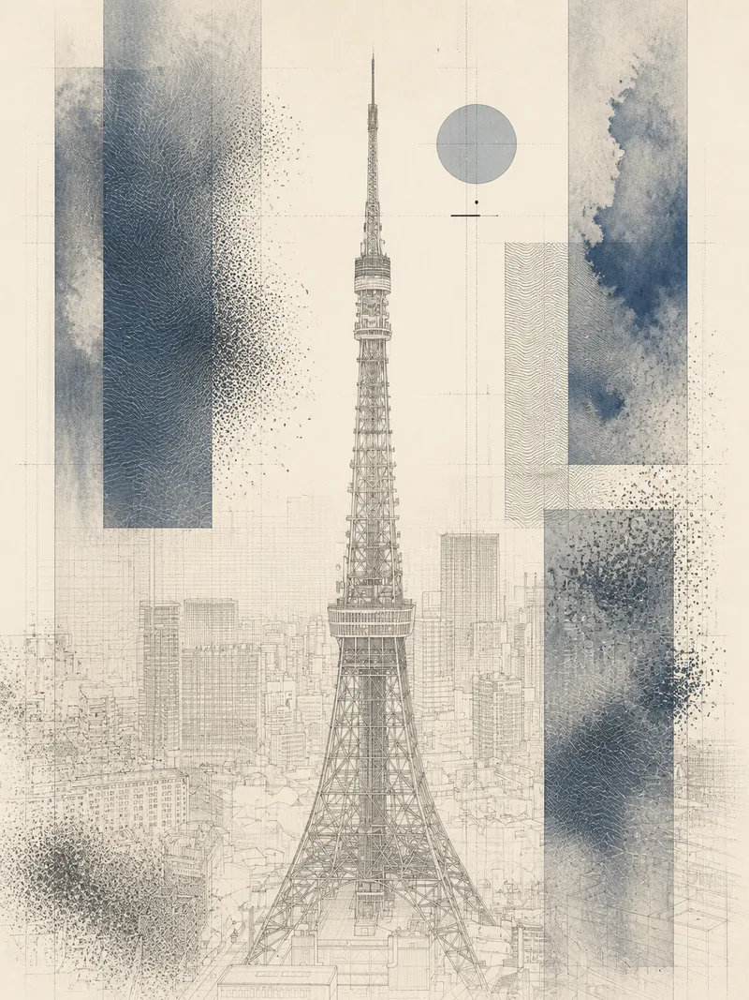</a><br><strong>S09 · Monochrome Data Garden</strong><br><sub>Plants, wind, particles, organic growth, soft motion · Medium</sub></td>
  </tr>
  <tr>
    <td width="33.33%" valign="top"><a href="assets/style-references/tokyo-tower-full/R-S10-A-selected-synthesis-full.png">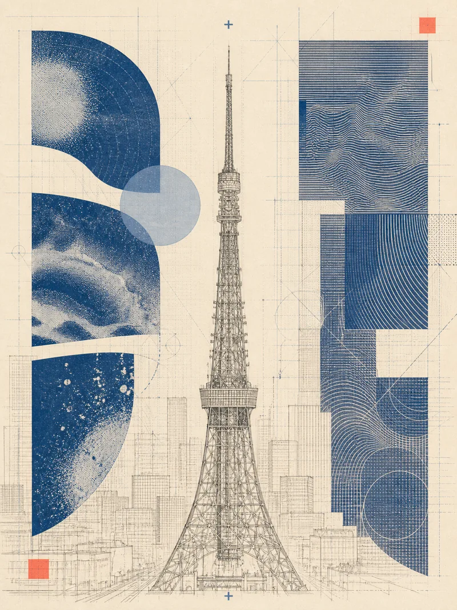</a><br><strong>S10 · Selected Synthesis</strong><br><sub>Organic curves set against architectural lines · Medium–high</sub></td>
    <td width="33.33%" valign="top"><a href="assets/style-references/tokyo-tower-full/R-S11-A-cyanotype-ma-registry-full.png">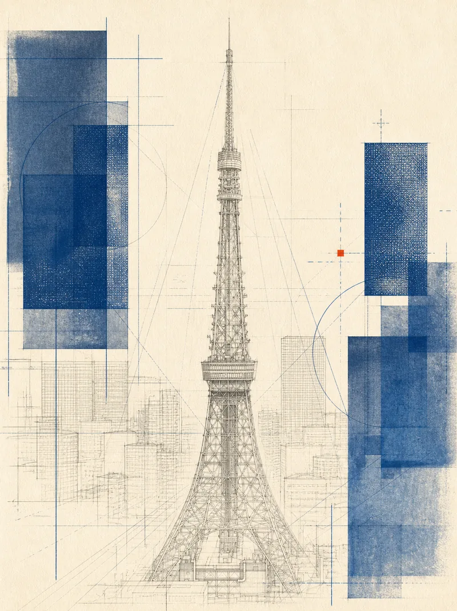</a><br><strong>S11 · Cyanotype Ma Registry</strong><br><sub>Centered or symmetric subjects, quiet edges, spatial silence · Low</sub></td>
    <td width="33.33%"></td>
  </tr>
</table>

## Semantic Selection Logic

When the user does not specify an `Sxx`, the Skill selects exactly one style and never blends programs:

1. An explicit user selection always wins.
2. Strong perspective or linear rhythm favors `S02`.
3. Multiple materials or structural complexity favors `S08`.
4. Quiet isolated subjects and abundant negative space favor `S04` / `S11`.
5. Fog, rain, sky, and atmospheric conditions favor `S07`.
6. Organic and architectural forms together favor `S10`.
7. When no stronger semantic signal exists, `S08` is the robust default.

Every delivery names the selected style and gives one concrete reason tied to the source image.

## Requirements

- Codex Desktop, or another Codex environment with the host-provided `image_gen.imagegen` tool;
- at least one accessible source image;
- Python 3, used for MPO input normalization, local asset validation, and output-ratio validation;
- no third-party image API key required.

### MPO Sources

`.mpo` multi-picture JPEG files are supported as source containers. Frame `0`, the primary image, is extracted by default. Inspect the frame list or choose another frame with:

```bash
python3 scripts/extract_mpo.py /absolute/path/to/source.mpo --list
python3 scripts/extract_mpo.py /absolute/path/to/source.mpo \
  --frame 0 --output /absolute/path/to/source-primary.jpg
```

Extraction only normalizes the input container; it does not generate or rewrite source content. Final posters remain ordinary 3:4 PNG outputs, and left/right stereo views are not merged into invented depth semantics automatically.

### Image-Generation Boundary

This Skill **only uses Codex's host-provided image-generation capability**. If the built-in tool is unavailable or fails, the workflow stops and reports the blocker. It never falls back to Ark, Doubao, Gemini, local models, CLIs, or other image services.

## Installation

### Option 1: Install Directly into Codex Skills

```bash
git clone https://github.com/WiseWong6/optical-zine-poster.git \
  ~/.codex/skills/optical-zine-poster
```

Update:

```bash
git -C ~/.codex/skills/optical-zine-poster pull --ff-only
```

### Option 2: Keep a Development Directory and Use a Symlink

```bash
git clone https://github.com/WiseWong6/optical-zine-poster.git \
  /path/to/optical-zine-poster
ln -s /path/to/optical-zine-poster \
  ~/.codex/skills/optical-zine-poster
```

The Skill is also included in [Wise Skills](https://github.com/WiseWong6/wise-skills), where you can browse my other Codex Skills in one place.

## Quick Start

Attach one source image in Codex, then invoke:

```text
$optical-zine-poster
Turn this image into an optical zine poster.
```

### Choose a Style

```text
$optical-zine-poster
Use S02 and turn this road photograph into a complete 3:4 full design.
```

### Request an Upper/Lower 1:1 Comparison

```text
$optical-zine-poster
Keep the previous style and use the original source to generate an upper-photo/lower-design 1:1 split.
```

### Browse Other Styles

```text
$optical-zine-poster
I want to explore other styles. Show me the style catalog and recommend suitable options.
```

### Choose an Output Location

```text
$optical-zine-poster
Use S11 for a complete full design and save it to /absolute/path/to/posters/.
```

## Request Modes

### Full Design (Default)

- Produces one complete 3:4 poster.
- Translates the entire canvas into the design system.
- Retains no rectangular photographic window or upper/lower split.
- Keeps the subject recognizable and the environment spatially coherent.

### Split 1:1 (Optional)

- Still produces one 3:4 poster.
- Places a faithful source photograph above and the designed translation below.
- Allows exactly one horizontal boundary at the midpoint.
- Starts again from the original source image rather than using the Full output as a second-generation input.

### Alternate Style (Optional)

- A newly selected `Sxx` defaults to Full Design.
- A Split alternate is generated only when explicitly requested.
- Every style exploration returns to the original source image.

## Output and Acceptance

By default, outputs are written under the calling task's workspace:

```text
outputs/optical-zine-poster/
├── <source>-full-Sxx-v1.png
├── <source>-full-Sxx-v1.prompt.md
├── <source>-split-Sxx-v1.png          # optional
└── <source>-split-Sxx-v1.prompt.md   # optional
```

Acceptance rules:

- Pixel dimensions must satisfy an exact `width:height = 3:4` ratio.
- Full must be a complete design with no photographic window or split composition.
- Split must contain exactly one midpoint boundary with visually equal upper and lower regions.
- The subject remains recognizable and the environment coherent.
- Logos, watermarks, UI grids, mockups, unrelated collage fragments, and gibberish are rejected.
- After a ratio failure, the Skill retries once from the original source with the same style. A second failure is preserved and explicitly reported as unaccepted.

## Known Boundaries

- Image models may not render precise small text reliably, so the visual system never depends on long readable copy.
- `validate_output.py` verifies exact ratio and basic image conditions, but the Split midpoint still requires a lightweight human check.
- Split 1:1 cannot currently be guaranteed precisely by the image model; the actual upper/lower proportion depends on the source image dimensions.
- Style references document choices; they are not model inputs. Passing one as a second image would break the Skill's traceable input boundary.
- `R-S08-B` is a secondary 2:3 aesthetic reference. It may only appear in explicitly labeled non-delivery areas and is not a valid output sample.

## About

Find me across social platforms as **@歪斯Wise**, where I share AI creation, agent workflows, visual design, and productivity tools.

<p>
  <a href="https://x.com/killthewhys">X / Twitter</a> ·
  <a href="https://www.xiaohongshu.com/user/profile/61f3ea4f000000001000db73">Xiaohongshu</a> ·
  <a href="https://github.com/WiseWong6/wise-skills">Wise Skills</a>
</p>

<p><strong>WeChat Official Account</strong></p>
<p></p>

## License

[MIT](LICENSE) © 2026 Wise Wong
